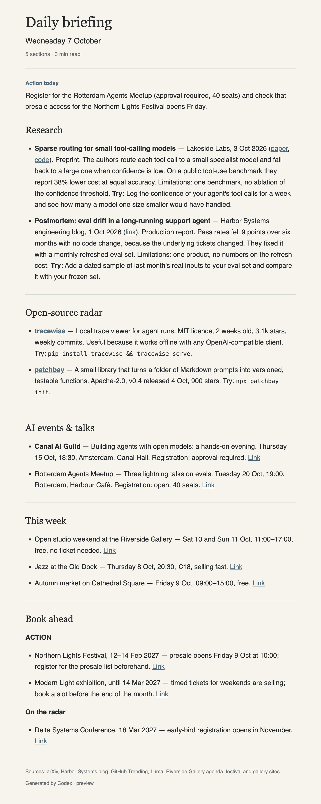

# daily-briefing

A GitHub Action that has Codex research your interests every morning and email you a short, sourced briefing. It runs on your own ChatGPT plan and on GitHub Actions' free minutes.



## How it works

1. **Schedule.** The workflow runs at your chosen local time, with up to two same-day hourly retries. The browser starter defaults to 07:00, 08:00 and 09:00 UTC.
2. **Guard.** If today's briefing was already sent, the run stops. The first attempt that succeeds sends; the others skip.
3. **Codex with live web search.** Codex reads your `interests.md` and one file per section, searches the web and writes the briefing as Markdown.
4. **Green HTML email.** The engine renders the Markdown as an HTML email and sends it over SMTP.
5. **State and login committed back.** Dedup state, the briefing archive and your encrypted Codex login are committed to your repository.

## Quick start

For guided setup, install Git and uv, then run:

```sh
uv tool run --from daily-briefing==1.1.0 daily-briefing init my-briefing
```

Setup confirms your personal GitHub account, tests email before creating a private
repository, collects interests and sections, and installs secrets before publishing
the workflow. Review its summary, then optionally launch your first cloud run.
Rerun `daily-briefing init my-briefing` after cancelling to preserve accepted files.
The generated repository's `AGENTS.md` and `CLAUDE.md` explain the tuning loop.

For browser-only setup:

Use the starter template: [vinkjoshua/daily-briefing-template](https://github.com/vinkjoshua/daily-briefing-template).

1. Click **Use this template** and create the repository as **Private**.
2. Add three secrets: `SMTP_USER`, `SMTP_PASSWORD` and `BRIEFING_KEY`.
3. Open the Actions tab and press **Run workflow**. You get an email with a login code.

The template README has the full walkthrough. The template's workflow calls this action as `vinkjoshua/daily-briefing@v1`:

```yaml
- uses: vinkjoshua/daily-briefing@v1
  with:
    smtp-user: ${{ secrets.SMTP_USER }}
    smtp-password: ${{ secrets.SMTP_PASSWORD }}
    auth-key: ${{ secrets.BRIEFING_KEY }}
```

## Self-repairing login

Codex needs a ChatGPT login, and logins expire. When the saved login stops working:

1. The scheduled run emails "reconnect needed". It does not fail the schedule.
2. Press **Run workflow** whenever it suits you. There is no deadline until you do.
3. The run emails a device code and prints it in the log. The code is valid for 15 minutes.
4. Enter the code at the OpenAI device page. The run saves the new login, encrypted, and sends your briefing.

## Inputs

| Input | Default | Description |
| --- | --- | --- |
| `smtp-user` | required | SMTP login, sender and default recipient. |
| `smtp-password` | required | SMTP password. For Gmail, an App Password. |
| `auth-key` | required | Random string of 32+ characters that encrypts the saved Codex login. |
| `timezone` | `Europe/Amsterdam` | IANA timezone that defines "today". |
| `smtp-host` | `smtp.gmail.com` | SMTP host. |
| `smtp-port` | `465` | `465` for implicit TLS, `587` for STARTTLS. |
| `mail-to` | empty (uses `smtp-user`) | Recipient. |
| `model` | empty (Codex default) | Optional Codex model override. |
| `reasoning-effort` | `high` | Codex reasoning effort. |
| `codex-version` | `0.160.0` | Codex CLI version to install. |
| `force` | `false` | Send even if today's briefing was already sent. |
| `github-token` | `${{ github.token }}` | Token used to commit state back to the repository. |

The template workflow uses `actions/checkout@v7`; the action itself uses `actions/setup-node@v7` and `astral-sh/setup-uv@v10.2.0`. Codex CLI 0.160.0 is pinned.

## Sections

Each section is one Markdown file in `sections/`. The file name sets the order. Front matter holds the title and icon. The body is the instruction Codex follows for that section.

```markdown
---
title: Research
icon: 🧠
---
Max 3 items. Papers from the last 7 days in the research areas in `interests.md`.
Per item: title, link, how the method works, limitations, one experiment I could try.
```

The starter template ships five sections: Research, Open-source radar, Professional events & talks, This week and Book ahead. Add, remove or reorder files to change the email.

## Security model

- **Private repositories only.** The engine refuses to run when the event says the repository is public. Your encrypted login lives in the repository.
- **Encrypted login.** The Codex login is encrypted with `BRIEFING_KEY` before it is committed. Without the key it is unreadable.
- **Codex gets no secrets.** Its environment is an allowlist (`PATH`, `HOME`, `LANG`, `LC_ALL`, `TZ`, `TMPDIR`, `USER`, plus `CODEX_HOME`). Its shell has no network.
- **Narrow commits.** The engine commits only `state/`, `briefings/` and `.briefing/`.

## Costs

- About 450 of the 2,000 free GitHub Actions minutes a month for private repositories.
- Codex usage counts against your ChatGPT plan.

## Development

```bash
uv sync
uv run pytest
uv run ruff check
uv run daily-briefing preview examples/sample-briefing.md --sections template/sections
```

## Licence

MIT.
